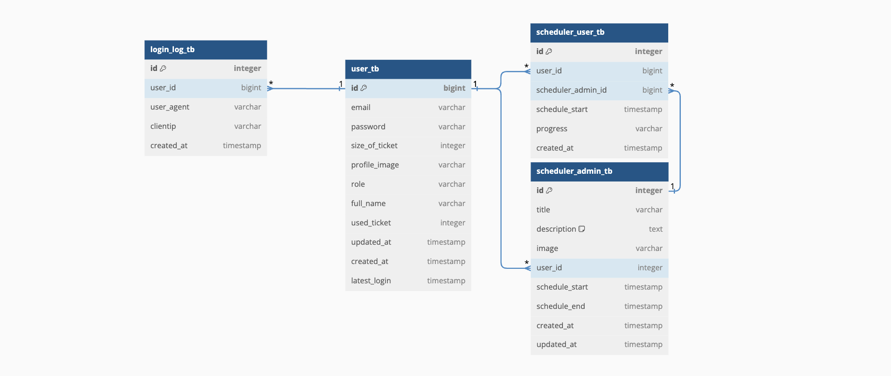
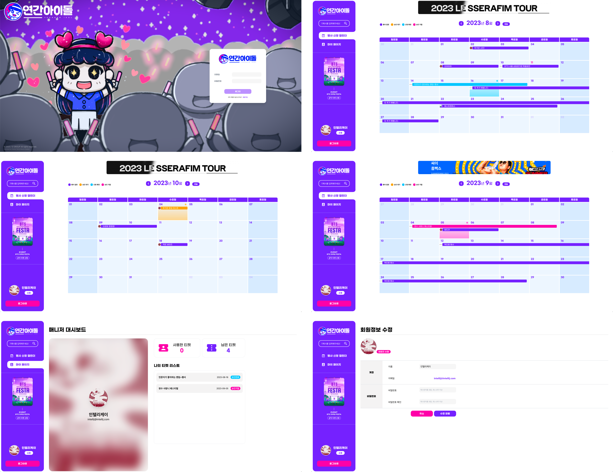
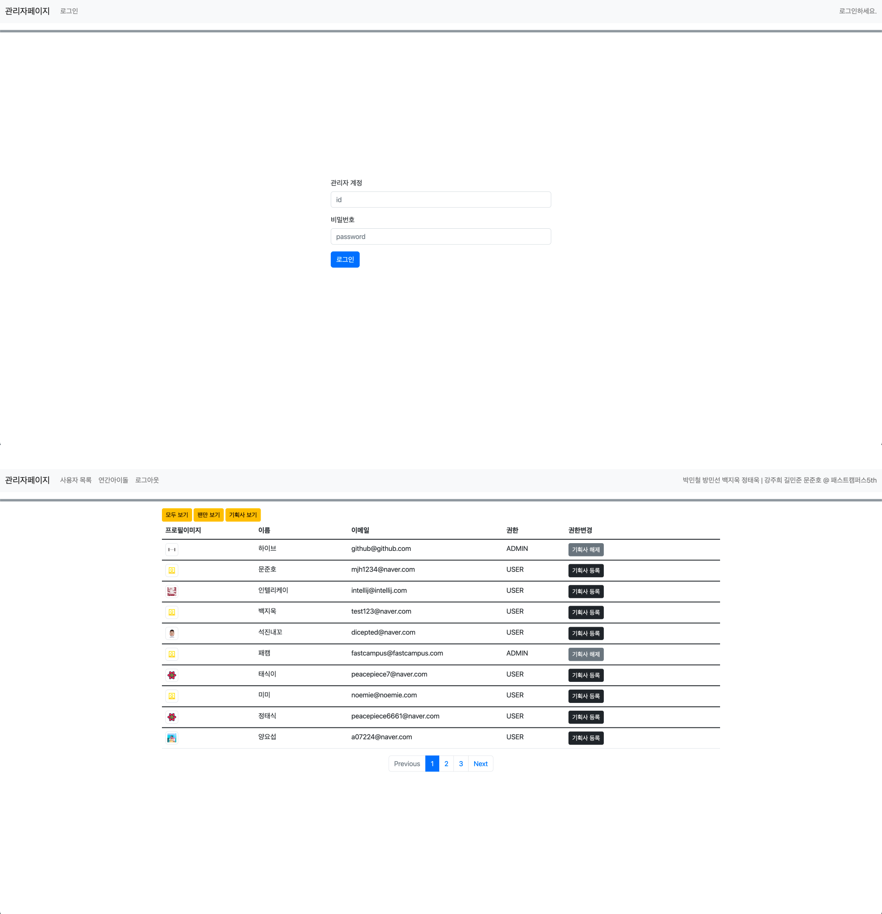

#  연간아이돌(YeonganIdol)


### 연차? 당직? 우리는 콘서트 보러 간다!!!

회사에서 연차, 당직을 사용하기 위해 남아있는 횟수를 확인하고, 신청하고 사용합니다.
<br> 우리는 덕질을 위해, 남아있는 티켓의 횟수를 확인하고, 신청하고 사용합니다.
<br> 연간아이돌은 덕질을 위해 만들어진 공연 신청 서비스입니다.
<br> 일상에 지친 당신에게 매달 한번!! 원하는 공연을 신청해서 티켓을 소진하세요!!
<br> 기획사는 연간아이돌을 통해 신청된 티켓의 승인, 거절을 결정할 수 있습니다. 홍보는 덤입니다.
<br> 기획사 권한 신청은 관리자에게 문의하세요.

미니 프로젝트 기간: 2023.07.24 ~ 2023.08.10<br>

<h3>🔗 바로가기</h3>

[](http://minischeduler-env.eba-m9yfe83y.ap-northeast-2.elasticbeanstalk.com/manager/)
[](http://ec2-34-228-10-85.compute-1.amazonaws.com/login/)
[](https://github.com/MINI-FASTCAMPUS5/scheduler-front)
[](https://github.com/MINI-FASTCAMPUS5/scheduler-back)
<h4> 기획사 계정으로 일정을 등록하고, 회원가입한 팬 계정으로 티케팅해보세요 <br>
ACCOUNT : fastcampus@fastcampus.com <br>
PASSWORD : alswns1!
</h4>

<h2>🛠️ 개발 환경 및 툴</h2>
<span>
    
     
     
    
    
    
    
    
</span>
<h2>📢 배포</h2>
<span>
    
    
    
</span>
<h2>💬 협업</h2>
<span>
    
    
    
    
</span>
---
<h2>👨‍👩‍👧‍👦 프론트엔드 팀</h2>
<div align=center>
    <table>
        <tr>
            <td align="center" width="170">
                <a href="https://github.com/peacepiece7"><br />
                <sub><b>정태욱(FE-리더)</b><br></sub></a>
            </td>
            <td align="center" width="170"><a href="https://github.com/DICEPT">
                <br />
                <sub><b>박철민</b><br></sub></a>
            </td>
            <td align="center" width="170"><a href="https://github.com/0299bang">
                <br />
                <sub><b>방미선</b><br></sub></a>
            </td>
            <td align="center" width="170"><a href="https://github.com/beakjiuk">
                <br />
                <sub><b>백지욱</b><br></sub></a>
            </td>
        </tr>
        <tr>
            <td ><font size=1>
                캘린더(유저/매니저),<br>캘린더 부가기능 전체,<br>프로젝트 셋팅,<br>로딩 애니메이션,<br>깃허브 관리,<br>사용자 마이페이지,<br>매니저 행사 등록/수정
            </font></td>
            <td ><font size=1>
                기획사 페이지,<br>매니저 대시보드,<br>디자인-1,<br>css 전역 스타일,<br>와이어프레임,<br>로그인 배경화면,<br>캐릭터 디자인
            </font></td>
            <td ><font size=1>
                사용자 페이지,<br>회원정보 수정,<br>디자인-2,<br>와이어프레임,<br>유저 플로우
            </font></td>
            <td ><font size=1>
                회원가입 페이지,<br>로그인 페이지
            </font></td>
        </tr>
    </table>
</div>
<h2>👨‍👩‍👧‍👦 백엔드 팀</h2>
<div align=center>
    <table>
        <tr>
            <td align="center" width="230"><a href="https://github.com/a07224">
                
                <br />
                <sub><b>강주희</b></sub></a><br />
            </td>
            <td align="center" width="230"><a href="https://github.com/k1m2njun">
                
                <br />
                <sub><b>길민준 (BE-리더)</b></sub></a><br />
            </td>
            <td align="center" width="230"><a href="https://github.com/backdoor95">
                
                <br />
                <sub><b>문준호</b></sub></a><br />
            </td>
        </tr>
        <tr>
            <td width="180"><font size=1>
                유저&기획사 메인 페이지,<br />유저 티켓팅 신청&취소,<br />기획사 검색,<br />행사 등록&취소&수정<br />
            </font></td>
            <td width="180"><font size=1>
                회원가입, JWT 로그인<br />승인결재 페이지 및 기능 API<br />AES256 인/디코딩<br />
                엑셀파일 다운로드 API<br />로그인 로그 기록<br />Eleastic Beanstalk 배포<br />
                500에러 파일 출력(log back)<br />팀 일정 계획, 깃헙 Repo 관리<br />API명세서 정리<br />코드 스타일 정리<br />
                관리자 페이지
            </font></td>
            <td width="180"><font size=1>
                유저&기획사 마이페이지 <br />AWS S3 서버 연결 <br />이미지 업로드&삭제 기능 <br />회원정보 수정<br />
            </font></td>
        </tr>
    </table>
</div>

---
## EDR


---
## API 명세서
#### 공통

#### 팬

#### 기획사

## 💻 전체 화면 구성
### 사용자 페이지 </br>

<br>
<br>

### 매니저(기획사) 페이지 </br>

<br>
<br>

### 관리자(권한 관리) 페이지 </br>

<br>
<br>

---
## 테이블
```sql
create table user_tb (
     id bigint not null auto_increment,
     created_at datetime not null,
     email varchar(60) not null unique,
     full_name varchar(60) not null,
     latest_login datetime,
     password varchar(60) not null,
     profile_image varchar(255),
     role varchar(255) not null,
     size_of_ticket integer,
     updated_at datetime,
     used_ticket integer,
     primary key (id)
) engine=InnoDB DEFAULT CHARSET=utf8mb4 COLLATE=utf8mb4_general_ci;
```

```sql
create table login_log_tb (
    id bigint not null auto_increment,
    clientip varchar(255),
    created_at datetime,
    user_agent varchar(255),
    user_id bigint,
    primary key (id),
    foreign key (user_id) references user_tb(id)
) engine=InnoDB DEFAULT CHARSET=utf8mb4 COLLATE=utf8mb4_general_ci;
```

```sql
create table scheduler_admin_tb (
    id bigint not null auto_increment,
    created_at datetime not null,
    description LONGTEXT,
    image varchar(255),
    schedule_end datetime,
    schedule_start datetime not null,
    title varchar(20),
    updated_at datetime,
    user_id bigint,
    primary key (id),
    foreign key (user_id) references user_tb(id) on update cascade 
) engine=InnoDB DEFAULT CHARSET=utf8mb4 COLLATE=utf8mb4_general_ci;

create table scheduler_user_tb (
   id bigint not null auto_increment,
   created_at datetime not null,
   progress varchar(255),
   schedule_start datetime not null,
   scheduler_admin_id bigint,
   user_id bigint,
   primary key (id),
   foreign key (user_id) references user_tb(id) on update cascade,
   foreign key (scheduler_admin_id) references scheduler_admin_tb(id) on update cascade
) engine=InnoDB DEFAULT CHARSET=utf8mb4 COLLATE=utf8mb4_general_ci;
```

```sql
create table manager_tb (
   id bigint not null auto_increment,
    created_at datetime not null,
    password varchar(255),
    username varchar(255),
    primary key (id)
) engine=InnoDB DEFAULT CHARSET=utf8mb4 COLLATE=utf8mb4_general_ci;
```

### 🙏 감사합니다 </br>
